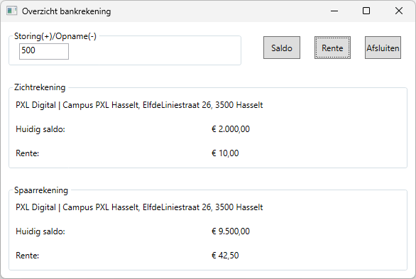
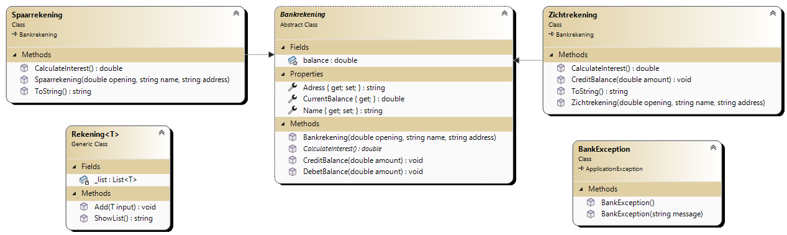

# Bankrekening

Een bank biedt de klanten 2 typen rekeningen aan: een gewone zichtrekening en een spaarrekening. Deze twee typen rekeningen bieden voor een deel dezelfde faciliteiten, maar er zijn ook verschillen. De gemeenschappelijke faciliteiten zijn:
- naam en adres vastleggen
- een rekening met een beginsaldo openen
- een overzicht van het huidige saldo bijhouden en laten zien
- methoden om een geldbedrag te storten en op te nemen

De spaarrekening kan niet in het rood staan in tegenstelling tot de zichtrekening. De rente voor een zichtrekening bedraagt 0,5% en voor een spaarrekening 1,5%. Voor een spaarrekening worden jaarlijks beheerskosten van €100,00 aangerekend.

***Bankrekening***

- *amountTextBox*: bij een positief bedrag wordt het bedrag op beide rekeningen gestort, bij een negatief bedrag wordt het bedrag bij beide rekeningen afgenomen.
- *balanceButton*: geeft het saldo weer van de zichtrekening en spaarrekening.
- *interestButton*: geeft de rente weer van de zichtrekening en spaarrekening.
- *closeButton*: sluit de toepassing.

Maak voor deze toepassing een ***abstracte klasse*** ***Bankrekening*** en 2 afgeleide klassen: ***Spaarrekening*** en ***Zichtrekening***.

- De klasse ***Bankrekening*** bevat de volgende methoden:
    - *Constructor* Bankrekening(double opening, string name, string address)
    - *CalculateInterest()* dat de over te erven method omschrijft
    - *CreditBalance()* haalt geld van de rekening
    - *DebetBalance()* bepaalt het positief saldo en geeft het aan *HuidigSaldo*
    - *CurrentBalance* geeft het saldo van de rekening terug
- De klasse ***Spaarrekening*** bevat de methoden:
    - *Constructor* Spaarrekening
    - *CalculateInterest()* berekent de rente van de spaarrekening
    - *CreditBalance()* haalt geld van de rekening, maar test eerst of het saldo toereikend is. Indien niet wordt een exception van de klasse *BankException* gegenereerd.
- De klasse ***Zichtrekening*** bevat de methoden:
    - *Constructor* Zichtrekening
    - *CalculateInterest()* berekent de rente van de spaarrekening
- De klasse ***BankException*** bevat enkel een constructor.
